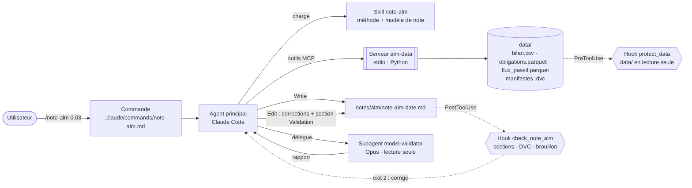

# M11 — Projet final : assistant ALM de bout en bout

**Objectif** : assembler tout ce qui précède en un assistant qui produit une note ALM sur le risque de taux, **traçable** (chaque chiffre vient d'un outil) et **validée** par un second regard.

## Utilisation
```bash
uv run python modules/07-mcp/server/make_sample_data.py   # données d'exemple (une fois)
claude                                                     # dans le repo, serveur alm-data approuvé
> /note-alm 0.03
```
Ou via le plugin, dans n'importe quel projet contenant un dossier `data/` : `/actuariat-toolkit:note-alm 0.03`.

## Architecture



| Brique | Rôle | Module |
|---|---|---|
| Commande `/note-alm` | Point d'entrée, enchaîne les 5 étapes | M05 |
| Skill [`note-alm`](../../.claude/skills/note-alm/SKILL.md) | Méthode (réconciliation, gap, ΔFP), modèle de note, règles de chiffrage — chargé seulement quand utile | M06 |
| Serveur MCP [`alm-data`](../07-mcp/server/server.py) | Données versionnées DVC + **calculs déterministes** (durations, convexités, `duration_gap`) | M07 |
| Subagent [`model-validator`](../../.claude/agents/model-validator.md) | Validation indépendante, contexte séparé, lecture seule, Opus | M05 |
| Hook [`check_note_alm.py`](../../.claude/hooks/check_note_alm.py) | Contrôle qualité déterministe de la note (7 sections dans l'ordre, md5 DVC, pas de TODO, synthèse ≤ 3 lignes) | M04 |
| Hook `protect_data.py` | Les données de référence ne peuvent pas être modifiées | M04 |
| Plugin `actuariat-toolkit` v0.2.0 | Distribution de l'ensemble | M08 |
| CI `tests.yml` | 92 tests + plugin à jour à chaque push | M10 |

Principe directeur : **le modèle orchestre, rédige et interprète ; le code calcule et contrôle.** Tout ce qui peut être déterministe (chiffres, structure de la note, protection des données) l'est.

## Démonstration (29/09/2026, headless, orchestrateur Sonnet 5.5 + valideur Opus 5.5)

| | v1 : sans outil `duration_gap` | v2 : avec `duration_gap` |
|---|---|---|
| Note | [note-alm-2026-09-29-v1.md](../../notes/alm/note-alm-2026-09-29-v1.md) | [note-alm-2026-09-29.md](../../notes/alm/note-alm-2026-09-29.md) |
| Calculs dérivés (gap, ΔFP) | par le modèle ; son script Python de contrôle a été refusé par les permissions → calcul « à la main » | repris de l'outil, zéro calcul par le LLM |
| Refus de permission | 3 | 0 |
| Hook de conformité | passé du premier coup | passé du premier coup |
| Verdict du valideur | validé avec réserves (2 majeurs corrigés : assiette du ratio ΔFP/FP, formulation) | conforme avec réserves (références réglementaires, limites ajoutées) |
| Coût / durée | 0,55 $ / 151 s | 0,44 $ / ~50 s (subagent en arrière-plan) |

Résultat métier (identique dans les deux versions, ce qui valide la v1 a posteriori) : les sources ne se réconcilient pas (best estimate −18 %), le **signe du duration gap dépend de la base** (−0,49 bilan / +0,81 recalculée) → la note refuse de conclure et recommande de trancher la base de valorisation avant toute couverture. C'est le comportement voulu par la règle du skill « ne pas conclure sur le signe si les deux bases divergent ».

## Enseignements
1. **Un outil de calcul vaut mieux qu'une consigne « vérifie tes calculs »** : la v1 était juste mais non traçable ; la v2 est traçable par construction, moins chère et plus rapide.
2. **Les hooks donnent des garanties que le prompt ne donne pas** : la structure de la note est vérifiée à chaque écriture, quel que soit le modèle.
3. **Le valideur doit avoir accès aux mêmes sources** : il a contrôlé l'arithmétique mais pas la provenance (pas d'accès MCP). Piste : lui ouvrir les outils `alm-data` en lecture.
4. **Données d'exemple imparfaites = bon test** : l'incohérence bilan/flux, non voulue au départ, a montré que l'assistant signale au lieu de lisser.

## Pistes
- Donner au valideur les outils MCP en lecture seule (`tools: Read, Grep, Glob, mcp__alm-data__*`).
- Remplacer le taux plat par la courbe EIOPA (module M02) dans `cashflow_duration`.
- Interface Streamlit au-dessus de l'Agent SDK (`alm_agent_sdk.py`, M09) pour les utilisateurs sans Claude Code.
- Workflow planifié (GitHub Actions `schedule` ou routine Claude) produisant la note à chaque arrêté.
